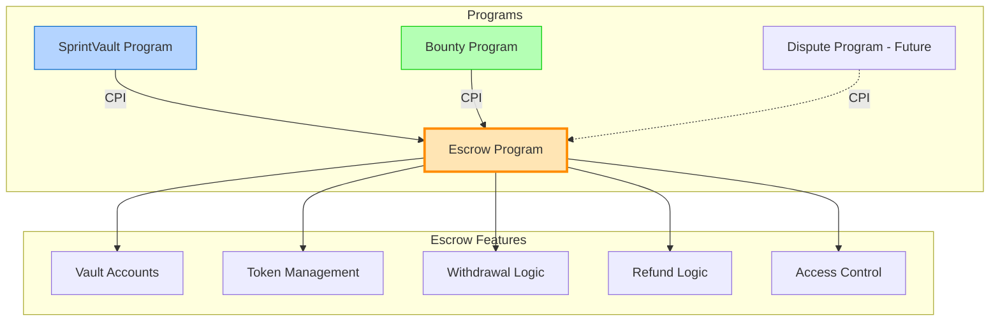

# Escrow Program - Centralized Fund Management System

## Executive Summary

This document analyzes the architectural decision to extract escrow functionality from the Sprint Vault program into a separate, dedicated Anchor program. The Escrow Program would serve as a centralized fund management system for both SprintVault and Bounty programs, providing a single source of truth for all financial operations.

## 🔍 Analysis: Separate Escrow Program

### ✅ **Pros (Good Design Aspects)**

1. **Single Source of Truth**

   - One escrow system managing all funds
   - Consistent accounting and balance tracking
   - Easier auditing of fund flows

2. **Reduced Code Duplication**

   - Both SprintVault and Bounty programs use the same escrow logic
   - Maintenance is centralized
   - Bug fixes apply to all consumers

3. **Enhanced Security**

   - Specialized program focused solely on fund management
   - Smaller attack surface for the critical money-handling code
   - Easier to audit and formally verify

4. **Flexibility for Future Programs**

   - New programs (Dispute, Staking, etc.) can easily integrate
   - Standardized interface for all fund management
   - Could support multiple token types centrally

5. **Atomic Multi-Program Transactions**
   - Could enable complex transactions spanning multiple programs
   - Better composability in the Solana ecosystem

### ❌ **Cons (Potential Issues)**

1. **Increased Complexity**

   - More CPIs = higher compute unit consumption
   - Additional program to deploy and maintain
   - More complex testing (need to test interactions)

2. **Performance Overhead**

   - Each CPI has overhead (~2-3k compute units)
   - Multiple CPIs per transaction could hit limits
   - Slightly higher transaction costs

3. **Dependency Risk**

   - If escrow program has issues, both programs fail
   - Upgrades need coordination across programs
   - Version compatibility concerns

4. **Account Size Limitations**
   - Need to pass more accounts in transactions
   - Could hit transaction size limits with complex operations

## 📊 **Design Recommendation**

Given the use case of multiple programs (SprintVault, Bounty, and future Dispute program) needing escrow functionality, **implementing a separate Escrow program is recommended** with appropriate design considerations.

### Proposed Architecture



## 🏗️ **Escrow Program Structure**

### Account Models

```rust
// Primary Escrow Vault Account
#[account]
pub struct EscrowVault {
    // Identity
    pub vault_id: u64,                      // Unique identifier
    pub owner_program: Pubkey,              // SprintVault or Bounty program
    pub owner_account: Pubkey,              // Sprint PDA or Bounty PDA

    // Participants
    pub depositor: Pubkey,                  // Employer who deposits funds
    pub beneficiary: Pubkey,                // Freelancer/Contributor who receives
    pub arbiter: Option<Pubkey>,            // Optional dispute resolver

    // Token Information
    pub token_mint: Pubkey,                 // SPL token mint
    pub vault_token_account: Pubkey,        // Associated token account

    // Amounts
    pub total_amount: u64,                  // Total deposited amount
    pub released_amount: u64,               // Amount already released
    pub refunded_amount: u64,               // Amount refunded to depositor
    pub locked_amount: u64,                 // Amount locked for disputes

    // Release Configuration
    pub release_schedule: ReleaseSchedule,  // How funds are released
    pub release_authority: ReleaseAuthority,// Who can trigger releases

    // Status
    pub status: EscrowStatus,               // Current vault status
    pub created_at: i64,                    // Creation timestamp
    pub updated_at: i64,                    // Last update timestamp
    pub expires_at: Option<i64>,            // Optional expiration

    // PDA
    pub bump: u8,                           // PDA bump seed
}

#[derive(AnchorSerialize, AnchorDeserialize, Clone)]
pub enum ReleaseSchedule {
    Immediate,                              // Release on request
    Linear {
        start: i64,
        end: i64
    },                                      // Time-based linear release
    Milestone {
        conditions: Vec<MilestoneCondition>
    },                                      // Condition-based release
    Hybrid {
        linear_portion: u64,                // Amount for linear release
        milestone_portion: u64,              // Amount for milestone release
        linear_config: LinearConfig,
        milestone_config: Vec<MilestoneCondition>,
    },                                      // Combined linear + milestone
    Custom {
        data: Vec<u8>
    },                                      // For future extensions
}

#[derive(AnchorSerialize, AnchorDeserialize, Clone)]
pub struct MilestoneCondition {
    pub milestone_id: u32,
    pub amount: u64,
    pub required_approval: Pubkey,
    pub is_completed: bool,
}

#[derive(AnchorSerialize, AnchorDeserialize, Clone)]
pub struct LinearConfig {
    pub start_time: i64,
    pub end_time: i64,
    pub acceleration_type: AccelerationType,
}

#[derive(AnchorSerialize, AnchorDeserialize, Clone)]
pub enum AccelerationType {
    Linear,
    Quadratic,
    Cubic,
}

#[derive(AnchorSerialize, AnchorDeserialize, Clone)]
pub enum ReleaseAuthority {
    Beneficiary,                            // Only beneficiary can withdraw
    Depositor,                              // Only depositor can release
    Either,                                 // Either party
    Both,                                   // Requires both signatures
    Program(Pubkey),                        // Specific program authority
    Arbiter,                                // Arbiter controls release
}

#[derive(AnchorSerialize, AnchorDeserialize, Clone, PartialEq)]
pub enum EscrowStatus {
    Initialized,                            // Created but not funded
    Funded,                                 // Funds deposited
    Active,                                 // Release schedule active
    Paused,                                 // Temporarily paused
    Completed,                              // All funds distributed
    Cancelled,                              // Cancelled and refunded
    Disputed,                               // Under dispute
}

// Escrow Configuration Account (Program-wide settings)
#[account]
pub struct EscrowConfig {
    pub authority: Pubkey,                  // Program authority
    pub fee_basis_points: u16,              // Platform fee (e.g., 100 = 1%)
    pub fee_recipient: Pubkey,              // Where fees go
    pub min_escrow_amount: u64,             // Minimum escrow size
    pub max_escrow_duration: i64,           // Maximum duration
    pub paused: bool,                       // Emergency pause
    pub version: u32,                       // Program version
    pub bump: u8,
}

// Audit Log Account (Optional)
#[account]
pub struct EscrowAuditLog {
    pub vault_id: u64,
    pub entries: Vec<AuditEntry>,
    pub bump: u8,
}

#[derive(AnchorSerialize, AnchorDeserialize, Clone)]
pub struct AuditEntry {
    pub timestamp: i64,
    pub action: EscrowAction,
    pub actor: Pubkey,
    pub amount: Option<u64>,
    pub details: String,
}

#[derive(AnchorSerialize, AnchorDeserialize, Clone)]
pub enum EscrowAction {
    Created,
    Funded,
    Released,
    Refunded,
    Paused,
    Resumed,
    Disputed,
    Resolved,
    Closed,
}
```

### Program Instructions

```rust
// 1. Initialize Program Configuration (One-time setup)
pub fn initialize_config(
    ctx: Context<InitializeConfig>,
    fee_basis_points: u16,
    min_escrow_amount: u64,
    max_escrow_duration: i64,
) -> Result<()>

// 2. Create Escrow Vault
pub fn create_escrow(
    ctx: Context<CreateEscrow>,
    vault_id: u64,
    beneficiary: Pubkey,
    total_amount: u64,
    release_schedule: ReleaseSchedule,
    release_authority: ReleaseAuthority,
    expires_at: Option<i64>,
) -> Result<()>

// 3. Deposit Funds into Escrow
pub fn deposit_funds(
    ctx: Context<DepositFunds>,
    amount: u64,
) -> Result<()>

// 4. Calculate Available Funds (View function)
pub fn calculate_available(
    ctx: Context<CalculateAvailable>,
) -> Result<u64>

// 5. Withdraw Available Funds
pub fn withdraw_available(
    ctx: Context<WithdrawAvailable>,
    max_amount: Option<u64>,
) -> Result<()>

// 6. Release Milestone Funds
pub fn release_milestone(
    ctx: Context<ReleaseMilestone>,
    milestone_id: u32,
) -> Result<()>

// 7. Refund Funds to Depositor
pub fn refund_funds(
    ctx: Context<RefundFunds>,
    amount: u64,
    reason: String,
) -> Result<()>

// 8. Update Release Schedule
pub fn update_release_schedule(
    ctx: Context<UpdateReleaseSchedule>,
    new_schedule: ReleaseSchedule,
) -> Result<()>

// 9. Pause Escrow
pub fn pause_escrow(
    ctx: Context<PauseEscrow>,
    reason: String,
) -> Result<()>

// 10. Resume Escrow
pub fn resume_escrow(
    ctx: Context<ResumeEscrow>,
) -> Result<()>

// 11. Initiate Dispute
pub fn initiate_dispute(
    ctx: Context<InitiateDispute>,
    reason: String,
) -> Result<()>

// 12. Resolve Dispute
pub fn resolve_dispute(
    ctx: Context<ResolveDispute>,
    resolution: DisputeResolution,
) -> Result<()>

// 13. Close Escrow
pub fn close_escrow(
    ctx: Context<CloseEscrow>,
) -> Result<()>

// 14. Emergency Withdraw (Admin only)
pub fn emergency_withdraw(
    ctx: Context<EmergencyWithdraw>,
    recipient: Pubkey,
) -> Result<()>
```

### PDA Derivations

```rust
// Escrow Vault PDA
seeds = [
    b"escrow_vault",
    owner_program.as_ref(),
    vault_id.to_le_bytes().as_ref()
]

// Escrow Config PDA (Singleton)
seeds = [b"escrow_config"]

// Audit Log PDA
seeds = [
    b"escrow_audit",
    vault_id.to_le_bytes().as_ref()
]

// Vault Token Account PDA
seeds = [
    b"escrow_token",
    vault_id.to_le_bytes().as_ref(),
    token_mint.as_ref()
]
```

## 🎯 **Implementation Strategy**

### Phase 1: Core Escrow - Minimal viable escrow for both programs

- [ ] initialize_config
- [ ] create_escrow
- [ ] deposit_funds
- [ ] calculate_available (linear release only)
- [ ] withdraw_available
- [ ] close_escrow

### Phase 2: Advanced Release Schedules - Enhanced release mechanisms

- [ ] Milestone-based releases
- [ ] Hybrid linear + milestone
- [ ] Custom acceleration curves
- [ ] update_release_schedule

### Phase 3: Dispute Handling - Dispute resolution features

- [ ] pause_escrow
- [ ] resume_escrow
- [ ] initiate_dispute
- [ ] resolve_dispute
- [ ] Arbiter assignment

### Phase 4: Integration & Testing - Program integration

- [ ] CPI from SprintVault
- [ ] CPI from Bounty
- [ ] Integration tests
- [ ] Performance optimization

## 💡 **Best Practices**

### 1. Program-Owned Escrows

```rust
// Each escrow is owned by the calling program
impl EscrowVault {
    pub fn validate_owner_program(&self, program_id: &Pubkey) -> Result<()> {
        require!(
            self.owner_program == *program_id,
            EscrowError::UnauthorizedProgram
        );
        Ok(())
    }
}
```

### 2. Access Control Matrix

```rust
pub fn validate_withdrawal_authority(
    escrow: &EscrowVault,
    caller_program: &Pubkey,
    signer: &Pubkey,
) -> Result<()> {
    match escrow.release_authority {
        ReleaseAuthority::Beneficiary => {
            require!(signer == &escrow.beneficiary, EscrowError::Unauthorized);
        },
        ReleaseAuthority::Program(authorized) => {
            require!(caller_program == &authorized, EscrowError::Unauthorized);
        },
        // ... other cases
    }
    Ok(())
}
```

### 3. Optimize CPI Calls

```rust
// Batch operations to minimize CPI overhead
pub fn batch_withdraw(
    ctx: Context<BatchWithdraw>,
    vault_ids: Vec<u64>,
) -> Result<Vec<u64>> {
    let mut withdrawn_amounts = Vec::new();

    for vault_id in vault_ids {
        // Process each withdrawal
        let amount = process_withdrawal(ctx, vault_id)?;
        withdrawn_amounts.push(amount);
    }

    Ok(withdrawn_amounts)
}
```

### 4. Version Management

```rust
impl EscrowConfig {
    pub fn is_compatible(&self, required_version: u32) -> Result<()> {
        require!(
            self.version >= required_version,
            EscrowError::IncompatibleVersion
        );
        Ok(())
    }
}
```

## 🚀 **Migration Path**

### Step 1: Start Embedded (Current State)

- Keep escrow logic in SprintVault initially
- Get the system working end-to-end
- Identify common patterns

### Step 2: Extract Common Interface

```rust
// Define trait for escrow operations
pub trait EscrowOperations {
    fn create_vault(&self, params: VaultParams) -> Result<()>;
    fn deposit(&self, amount: u64) -> Result<()>;
    fn withdraw(&self, amount: u64) -> Result<()>;
    fn calculate_available(&self) -> Result<u64>;
}
```

### Step 3: Deploy Escrow Program

- Deploy separate escrow program to devnet
- Test thoroughly with small amounts
- Verify all edge cases

### Step 4: Gradual Migration

```rust
// Support both old and new escrows during transition
pub enum EscrowType {
    Legacy(LegacyEscrow),
    External(ExternalEscrow),
}

impl Sprint {
    pub fn migrate_to_external_escrow(&mut self) -> Result<()> {
        // Migration logic
    }
}
```

### Step 5: Full Cutover

- All new operations use escrow program
- Migrate remaining legacy escrows
- Deprecate embedded escrow code

## 📈 **Decision Matrix**

| Factor           | Embedded Escrow | Separate Escrow | Winner   |
| ---------------- | --------------- | --------------- | -------- |
| Simplicity       | ⭐⭐⭐⭐⭐      | ⭐⭐⭐          | Embedded |
| Maintainability  | ⭐⭐⭐          | ⭐⭐⭐⭐⭐      | Separate |
| Security         | ⭐⭐⭐⭐        | ⭐⭐⭐⭐⭐      | Separate |
| Performance      | ⭐⭐⭐⭐⭐      | ⭐⭐⭐⭐        | Embedded |
| Flexibility      | ⭐⭐⭐          | ⭐⭐⭐⭐⭐      | Separate |
| Future-proofing  | ⭐⭐⭐          | ⭐⭐⭐⭐⭐      | Separate |
| Composability    | ⭐⭐            | ⭐⭐⭐⭐⭐      | Separate |
| Audit Simplicity | ⭐⭐⭐          | ⭐⭐⭐⭐⭐      | Separate |

## 🔒 **Security Considerations**

### 1. Reentrancy Protection

```rust
// Use Anchor's reentrancy protection
#[access_control(non_reentrant)]
pub fn withdraw_available(ctx: Context<WithdrawAvailable>) -> Result<()> {
    // Withdrawal logic
}
```

### 2. Arithmetic Safety

```rust
// Always use checked arithmetic
let available = total_amount
    .checked_sub(released_amount)
    .ok_or(EscrowError::ArithmeticOverflow)?;
```

### 3. Authority Validation

```rust
// Strict validation of all authorities
pub fn validate_authorities(ctx: &Context<WithdrawAvailable>) -> Result<()> {
    let escrow = &ctx.accounts.escrow;
    let signer = &ctx.accounts.signer;

    // Multiple layers of validation
    escrow.validate_owner_program(&ctx.program_id)?;
    escrow.validate_beneficiary(signer.key)?;
    escrow.validate_status(EscrowStatus::Active)?;

    Ok(())
}
```

### 4. Rate Limiting

```rust
#[account]
pub struct WithdrawalTracker {
    pub last_withdrawal: i64,
    pub daily_amount: u64,
    pub daily_limit: u64,
}

impl WithdrawalTracker {
    pub fn can_withdraw(&self, amount: u64, current_time: i64) -> Result<()> {
        // Implement rate limiting logic
    }
}
```

## 🧪 **Testing Strategy**

### Unit Tests

```typescript
describe("Escrow Program", () => {
  describe("Create Escrow", () => {
    it("Should create linear release escrow");
    it("Should create milestone release escrow");
    it("Should reject invalid parameters");
    it("Should enforce minimum amounts");
  });

  describe("Withdrawals", () => {
    it("Should calculate linear release correctly");
    it("Should enforce release schedule");
    it("Should prevent overdraw");
    it("Should handle acceleration curves");
  });

  describe("Disputes", () => {
    it("Should pause on dispute");
    it("Should require arbiter for resolution");
    it("Should distribute according to resolution");
  });

  describe("CPI Integration", () => {
    it("Should accept CPI from SprintVault");
    it("Should accept CPI from Bounty");
    it("Should reject unauthorized programs");
  });
});
```

### Integration Tests

```typescript
describe("Cross-Program Integration", () => {
  it("Should handle Sprint creation with escrow");
  it("Should handle Bounty milestone releases");
  it("Should coordinate dispute resolution");
  it("Should maintain consistency across programs");
});
```

### Performance Tests

```typescript
describe("Performance", () => {
  it("Should handle batch operations efficiently");
  it("Should stay within compute limits");
  it("Should optimize CPI calls");
});
```

## 🎯 **Final Recommendation**

**Implement the separate Escrow program** with the following priorities:

1. **Start Simple**: Begin with core deposit/withdraw functionality
2. **Focus on Security**: Prioritize fund safety over features
3. **Design for Extension**: Use enums and versioning for future growth
4. **Monitor Performance**: Track CPI costs and optimize as needed
5. **Plan Migration**: Design with backward compatibility in mind

### Benefits Summary

- **Clean separation of concerns**: Each program focuses on its domain
- **Reusable financial infrastructure**: One audited escrow for all
- **Easier compliance**: Centralized fund management
- **Foundation for ecosystem**: Enables future program integration
- **Reduced audit scope**: Security-critical code in one place

### Risk Mitigation

- **Use conservative limits initially**: Start with low maximums
- **Implement emergency pause**: Admin can halt operations if needed
- **Comprehensive testing**: Both unit and integration tests
- **Gradual rollout**: Test on devnet extensively first
- **Version management**: Plan for upgrades from day one

The additional complexity of CPI calls is outweighed by the long-term benefits of having a robust, reusable escrow infrastructure that can serve the entire program ecosystem.
